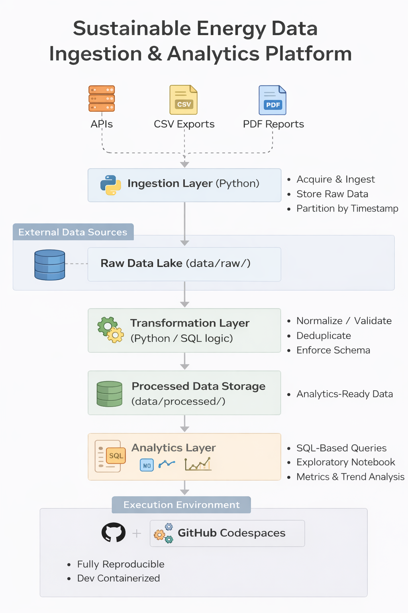

# Sustainable Energy Data Ingestion & Analytics Platform

## Overview
This repository demonstrates a production-style data engineering platform for ingesting, transforming, and analyzing sustainability and energy-related datasets from heterogeneous external sources. The project focuses on building reliable, SQL-centric data pipelines that support analytics and product decision-making in the context of the Green Economy and energy sustainability.

The system is intentionally designed to mirror real-world SaaS data platforms, handling messy external data while enforcing data quality, schema consistency, and reproducible execution environments.

---

## Architecture



**High-level flow:**

- External data sources (APIs, CSV exports, PDF reports)
- Python-based ingestion layer
- AWS-style raw data lake (immutable storage)
- Transformation layer enforcing schema and data quality
- Analytics-ready processed datasets
- SQL-first analytics executed in a reproducible environment

---

## Key Capabilities
- Acquisition and ingestion of data from:
  - Government open data APIs
  - Third-party data providers
  - CSV database exports
  - Public PDF reports
- Schema normalization, type casting, and deduplication
- Automated data quality validation and testing
- SQL-based analytics and trend analysis
- AWS S3–style data lake design (simulated locally)
- Fully reproducible development environment using GitHub Codespaces

---

## Repository Structure

```
├── .devcontainer/ # Reproducible GitHub Codespaces environment
├── ingestion/ # Data acquisition and ingestion scripts
├── transformation/python/ # Data transformation and normalization logic
├── analytics/ # SQL-based analytics and execution layer
│ ├── exploratory_analysis.ipynb
│ ├── run_analytics.py
│ ├── sustainability_metrics.sql
│ └── trend_analysis.sql
├── tests/ # Automated data quality and schema tests
├── data/ # Local data lake (raw / processed)
├── requirements.txt # Python dependencies
└── README.md
```

---

## Analytics Layer
Analytics is implemented primarily through SQL on top of the processed data layer.

- **SQL files** define product-facing sustainability metrics and trend analysis
- **Python runner** (`run_analytics.py`) executes analytics in a portable SQLite environment
- **Exploratory notebook** is used only for data understanding and validation, not production logic

This separation ensures analytics remains reproducible, testable, and production-ready.

---

## Technology Stack
- **Languages:** Python, SQL
- **Data Processing:** Pandas
- **Storage Format:** Parquet
- **Testing:** Pytest (data quality & schema validation)
- **Analytics Execution:** SQLite (via Python)
- **Cloud Concepts:** AWS S3-style partitioned data lake
- **Environment:** GitHub Codespaces, Dev Containers
- **Version Control:** Git, GitHub

---

## Running the Project (GitHub Codespaces)

This project is configured to run out-of-the-box in GitHub Codespaces.

1. Open the repository on GitHub  
2. Click **Code → Codespaces → Create codespace on main**
3. Wait for the environment to build automatically

All dependencies are installed automatically via `.devcontainer`.

---

## Running Locally (Optional)

```bash
python -m venv .venv
source .venv/bin/activate
pip install -r requirements.txt
pip install fastparquet

Run Automated Tests
pytest -q


Tests validate:

Required schema fields

Detection of invalid or unexpected values

Basic data quality guarantees

Run the Pipeline End-to-End
Transform Data
python transformation/python/transform_data.py \
  --dataset energy_metrics \
  --data-dir data

Run Analytics
python analytics/run_analytics.py

Why This Project Matters

This project demonstrates hands-on experience with:

Designing and implementing data pipelines

Leading ingestion from unreliable external data sources

Applying automated data quality validation

Building SQL-first analytics layers

Working independently with minimal supervision

Supporting sustainability-focused, data-driven products

It reflects real-world database and data engineering challenges rather than toy examples.

Author

Bita Ashoori
Database / Data Engineer
Vancouver, BC
